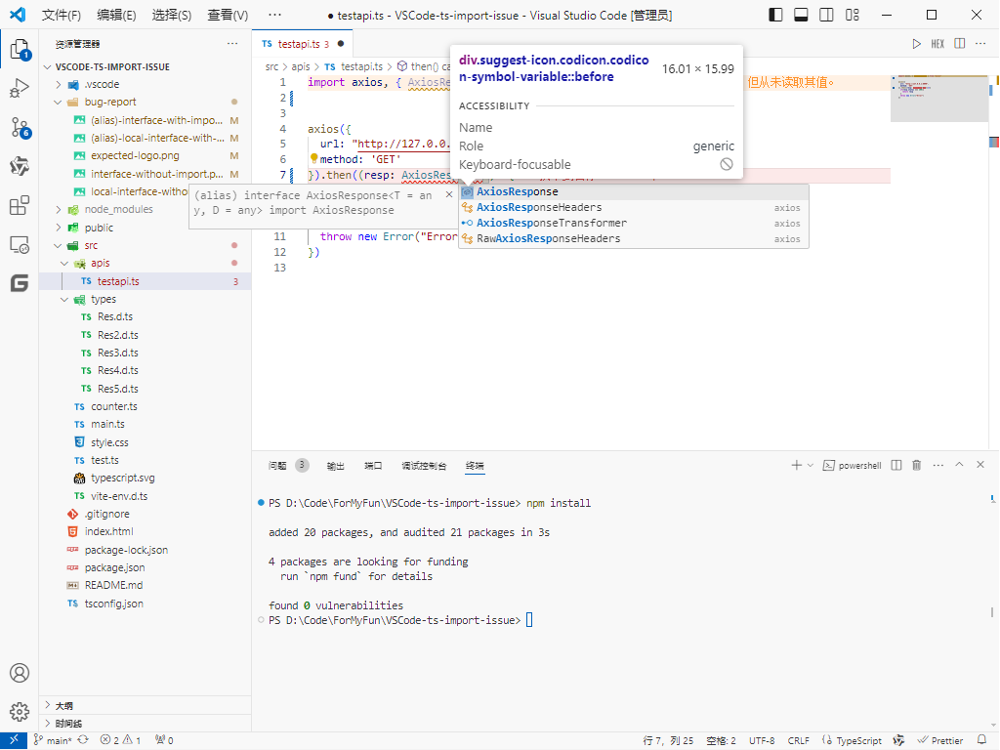

# VSCode TS Intellisense Bug

<!-- ⚠️⚠️ Do Not Delete This! feature_request_template ⚠️⚠️ -->

<!-- Please read our Rules of Conduct: https://opensource.microsoft.com/codeofconduct/ -->

<!-- Please search existing issues to avoid creating duplicates. -->

<!-- Describe the feature you'd like. -->

# Description
When I import a class/interface/type when using the JS/TS intellisense, the logo will not appear as expected.
It's not a fatal error, but it's annoying to me.

# Enviroment

- Version of VS Code: 1.90.1
- Operating System: Windows 10
- Extensions: @builtin JS/TS support

# Reproduction

- Init a JS/TS project or use repo: https://github.com/LdoDoeg222/VSCode-ts-import-issue
  - Use repo
    - Code yourself
      1. Type to use a class/interface/type and you can see: the intellisense will support a c/i/t with correct logo.
      2. Import the c/i/t then use it, and you can see: the logo of c/i/t will change to a var logo, which infers to (alias) c/i/t Xxxx
    - Use snippet
      1. Use snippet "test", "test2", "test3" to reproduce the bug.
  - Make an enviroment of the project by yourself, then code yourself.v (install some package, or write some class/interface/type code in a file)
    1. Type to use a class/interface/type and you can see: the intellisense will support a c/i/t with correct logo.
    2. Import the c/i/t then use it, and you can see: the logo of c/i/t will change to a var logo, which infers to (alias) c/i/t Xxxx

I try `export {<interface>}`, `export default <interface>`, `export interface <interface>`, `export default interface <interface>`, but all of them are wrong.
Except `declare interface <interface>` first, but it will cause ts2404 error if I don't use default export.

It seems that the problem is caused by the import alias.
- `import {<interface> [as <alias>]} from '<path>'`
- `export { <interface> [as <alias>] }`

Both of the sentences use aliases (even if they may not be used), the logo will change to a var logo as soon.

# What Expected

Expect: When i use a class/interface/type import, even if i use alias import (like `import type { AxiosResponse as AResp } from 'axios'`), I can see the correct logo.

This is the expected result, the logo is correct.

This is the actual result, the logo is wrong.
-interface-with-import.png)

This is the expected result, the logo is correct.

This is the actual result, the logo is wrong.
-local-interface-with-import.png)

What the develop tools show:

